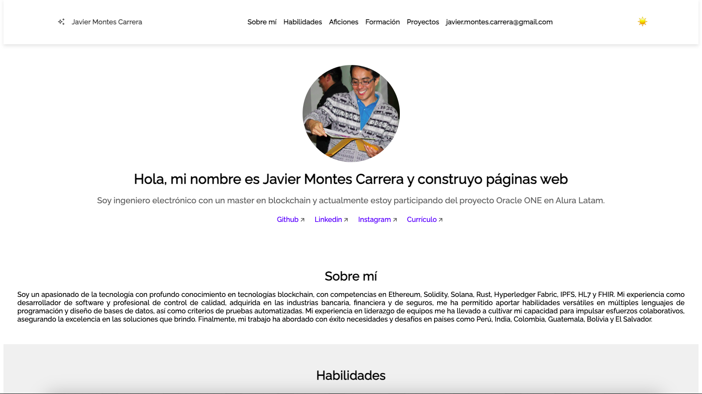
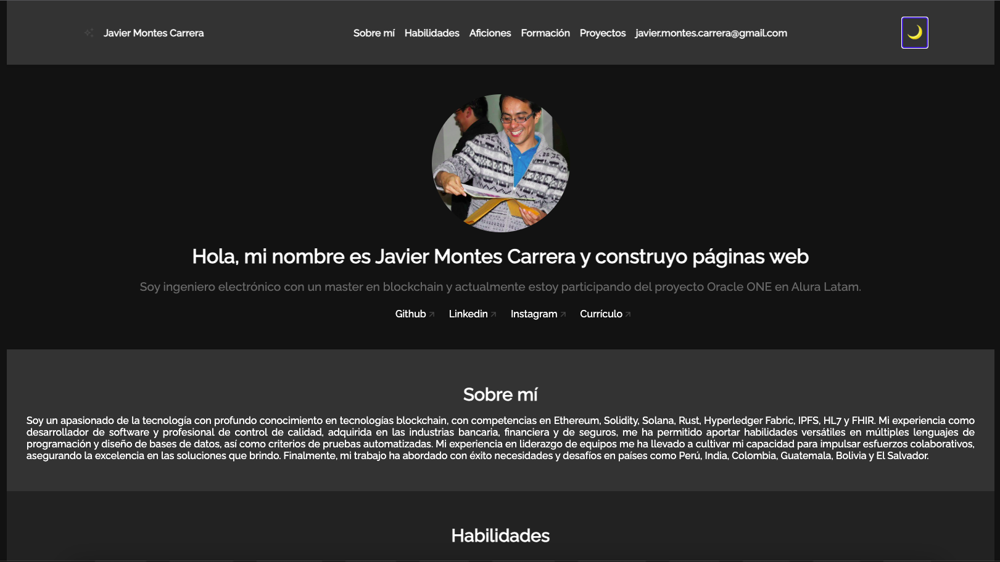
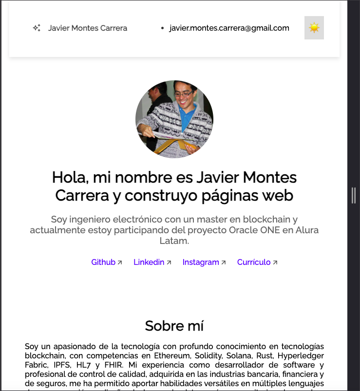
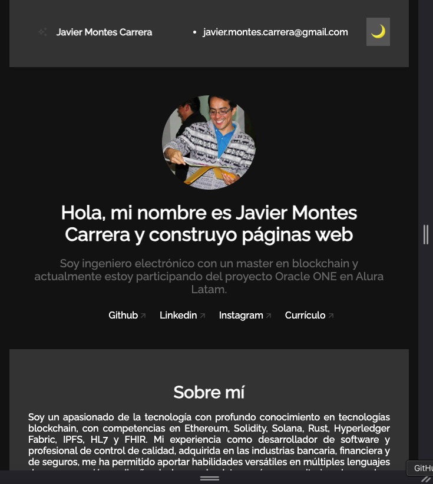

# Mi Portafolio - Challenge Oracle ONE y Alura

Este es mi portafolio, en el que muestro mis habilidades, formación y experiencia en el desarrollo web.

## Características

* Modo oscuro/claro: Puedes cambiar el estilo de la página entre un tema oscuro y uno claro según tus preferencias.
* Navegación: La página tiene una navegación principal que te permite acceder a las diferentes secciones de la página.
* Sección de presentación: En esta sección te presento con una imagen y un breve texto sobre mí.
* Sección de habilidades: Aquí te muestro mis habilidades en el desarrollo web en forma de lista.
* Sección de aficiones: En esta sección te muestro mis aficiones en forma de lista.
* Sección de formación: Aquí te muestro mi formación académica en forma de lista.
* Sección de proyectos: En esta sección te muestro algunos proyectos en los que he trabajado.
* Sección de contacto: En esta sección te muestro mi correo electrónico y un enlace a mi perfil de GitHub.

## Transiciones en Habilidades y Aficiones

### Habilidades
En la sección de habilidades, se ha implementado una transición visual que se activa al pasar el cursor sobre los elementos de la lista. Al hacerlo, el recuadro que contiene cada habilidad se amplía ligeramente, proporcionando un efecto de enfoque que resalta la habilidad seleccionada. Esta transición se logra mediante la propiedad `transform: scale(1.10);` junto con `transition: transform 0.3s;` para suavizar el cambio, creando una experiencia más dinámica e interactiva para el usuario.

### Aficiones
De manera similar, en la sección de aficiones, se ha aplicado un efecto de transición al pasar el cursor sobre los iconos. Cada icono se amplía un poco, lo que proporciona un feedback visual al usuario, destacando la afición sobre la que se está enfocando. Este efecto se implementa utilizando también `transform: scale(1.10);` y `transition: transform 0.3s;`, garantizando coherencia en las transiciones a lo largo del portafolio y mejorando la usabilidad del sitio.

## Validaciones en JavaScript

En este proyecto, se han implementado validaciones en JavaScript para el formulario de contacto. Estas validaciones se activan al enviar el formulario y verifican si se han ingresado los datos correctamente en cada campo. Si algún campo no cumple con los requisitos, se muestra un mensaje de error debajo del campo correspondiente, permitiendo al usuario corregir los errores y enviar el formulario correctamente.

## Imágenes

### Modo claro

### Modo oscuro

### Tablet modo claro

### Tablet modo claro
